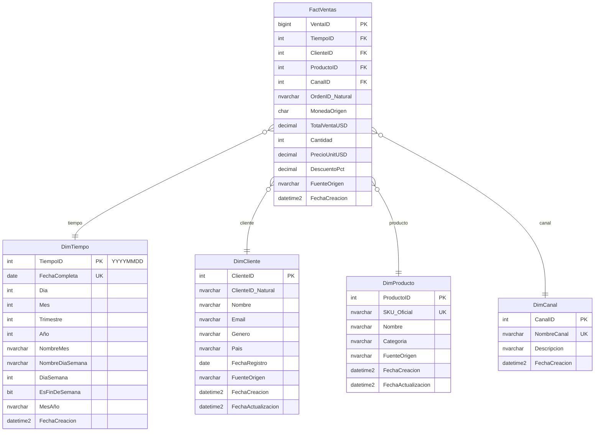

# Multi-Database Integration Project (Example)

By.:
---

**Project Overview.:** Given a company that has multiple sales sources stored across different database engines:
- MS SQL Server (USD transactions)
- MySQL
- Supabase/PostgreSQL
- MongoDB
- Neo4j

Each contains Customers, Products, Orders, and Order Details with inconsistent formats (currencies, IDs, date formats, and codes). This project unifies all of them into a central Data Warehouse (DW) in MS SQL Server using an ETL process and provides web apps and dashboards for analytics and visualization.

## Datewarehouse diagram


## Repository Structure
``` bash
data-environment-project/
│
├── README.md
├── .env.example
├── docker-compose.yml
├── requirements.txt
├── docs/
│   ├── architecture-diagram.png
│   ├── ETL-Process.md
│   ├── PowerBI-Dashboard.md
│   └── Developer-Guidelines.md
├── scripts/
│   ├── mssql/
│   │   ├── create_dw_schema.sql
│   │   └── metas_ventas_table.sql
│   ├── mysql/
│   │   └── create_mysql_schema.sql
│   ├── supabase/
│   │   └── create_supabase_schema.sql
│   ├── mongo/
│   │   └── seed_mongo_data.js
│   ├── neo4j/
│   │   └── create_neo4j_constraints.cypher
│   └── etl/
│       └── etl_pipeline.py
├── backend/
│   ├── etl/
│   │   ├── main.py
│   │   └── transformations/
│   │       ├── normalize_currency.py
│   │       ├── unify_gender.py
│   │       ├── map_products.py
│   │       └── format_dates.py
│   ├── services/
│   │   ├── apriori.py
│   │   ├── exchange_rate_service.py
│   │   └── logger.py
│   ├── api/
│   │   ├── main.py
│   │   ├── routers/
│   │   │   ├── mysql_routes.py
│   │   │   ├── supabase_routes.py
│   │   │   ├── mongo_routes.py
│   │   │   ├── neo4j_routes.py
│   │   │   └── dw_routes.py
│   │   └── models/
│   │       └── schemas.py
│   └── tests/
│       └── test_etl_pipeline.py
├── frontend/
│   ├── public/
│   ├── src/
│   │   ├── components/
│   │   ├── pages/
│   │   │   ├── mysql-dashboard.tsx
│   │   │   ├── supabase-dashboard.tsx
│   │   │   ├── mongo-dashboard.tsx
│   │   │   ├── neo4j-dashboard.tsx
│   │   │   └── datawarehouse-dashboard.tsx
│   │   └── utils/
│   ├── package.json
│   └── vite.config.ts
└── powerbi/
    ├── datasets/
    └── dashboards/
```

## Prerequisites
Make sure you have installed:
- Docker & Docker Compose
- Python 3.10+
- Node.js 18+
- Power BI Desktop
- Git

## Technologies Used
---
### Backend
- **FastAPI** - Modern Python web framework for building APIs
- **Python** 3.13 - Programming language
- **Multiple** Database Drivers:
- **MongoDB** (PyMongo)
- **MySQL** (MySQL Connector)
- **Neo4j** (Neo4j Python Driver)
- **Supabase** (Supabase Python Client)
- **Docker** - Containerization
- **Pydantic** - Data validation and settings management

### Frontend
- **React** - JavaScript library for building user interfaces
- **Vite** - Frontend build tool and development server
- **ESLint** - Code linting and quality
- **Modern JavaScript (ES6+)** - Latest JavaScript features
- **Axios** - HTTP client for API requests
---

# Setup
## Backend
```bash
cd backend
python -m venv venv
source venv/bin/activate  # On Windows: venv\Scripts\activate
pip install -r requirements.txt
# Set up environment variables

#-----------------------------
# Run Backend (local)
#-----------------------------
python run.py
```

## Fontend
```bash
cd frontend
npm install

#-----------------------------
# Run Fontend (local)
#-----------------------------
npm run dev  
```


