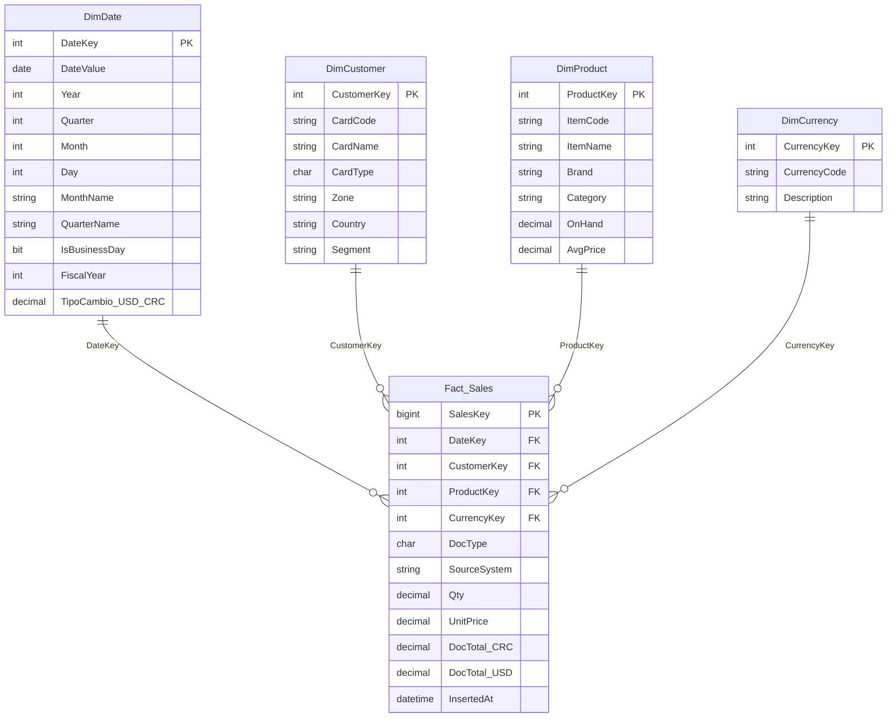

# Dummy DataWarehouse 

- **Model:** STAR (simple and clear for this exercise).
- **Fact:** Fact_Sales (one row per document line: OINV/ORIN/aggregated JSON).
- **Currencies:** We will maintain amounts in CRC (colons) and USD; exchange rates are provided in CSV TIPOS_DE_CAMBIO (Date, - TipoCambio_USD_CRC; using a CSV is easier).
- **Credit notes:** These are loaded as negative values ​​(use a -1 sign).
- **AGG_VENTAS_USD (JSON):** Create a generic AGGREGATE customer.

## Mermaind


## Step by step

### 0. Prerequisites
- Install and open SQL Server Management Studio (SSMS).
- Ensure the CSV and JSON files are accessible to the SQL Server instance.


### 1. Restaurar DB_SALES (.bak)

You can follow this video "[How to Import Database .BAK file in SSMS](https://youtu.be/zf6NdLKpo08)" with the backup file (.bak), or do it manually by:
```sql 
-- RESTORE DB_SALES from .bak
RESTORE DATABASE DB_SALES
FROM DISK = N'C:\mssql\backup\DB_SALES.bak'
WITH
    MOVE 'DB_SALES_Data' TO 'C:\mssql\data\DB_SALES.mdf',
    MOVE 'DB_SALES_Log'  TO 'C:\mssql\log\DB_SALES.ldf',
    REPLACE;
GO
```

### 2. Update dates (add 4 years)

The OINV and ORIN tables are in 2020, therefore they must be moved to 2024 (adding 4 years):

```sql
USE DB_SALES;
GO

-- Before: count by year
SELECT YEAR(DocDate) AS Ano, COUNT(*) AS Cant
FROM OINV
GROUP BY YEAR(DocDate)
ORDER BY Ano;

SELECT YEAR(DocDate) AS Ano, COUNT(*) AS Cant
FROM ORIN
GROUP BY YEAR(DocDate)
ORDER BY Ano;

-- Update: add 4 years
BEGIN TRANSACTION;
UPDATE OINV
SET DocDate = DATEADD(year, 4, DocDate),
    DocDueDate = CASE WHEN DocDueDate IS NOT NULL THEN DATEADD(year, 4, DocDueDate) ELSE NULL END;
    
UPDATE ORIN
SET DocDate = DATEADD(year, 4, DocDate),
    DocDueDate = CASE WHEN DocDueDate IS NOT NULL THEN DATEADD(year, 4, DocDueDate) ELSE NULL END;
COMMIT TRANSACTION;
GO
```

### 3. Create/Plan the Datawarehouse (STAR Schema)

```sql
-- Create DW
CREATE DATABASE DW_SALES;
GO

USE DW_SALES;
GO

-- DimDate
CREATE TABLE DimDate (
    DateKey INT PRIMARY KEY, -- YYYYMMDD
    DateValue DATE NOT NULL,
    [Year] INT,
    [Quarter] INT,
    [Month] INT,
    [Day] INT,
    MonthName NVARCHAR(20),
    QuarterName NVARCHAR(10),
    IsBusinessDay BIT,
    FiscalYear INT,
    TipoCambio_USD_CRC DECIMAL(18,6) NULL
);
-- DimCustomer
CREATE TABLE DimCustomer (
    CustomerKey INT IDENTITY(1,1) PRIMARY KEY,
    CardCode NVARCHAR(50) UNIQUE,
    CardName NVARCHAR(200),
    CardType CHAR(1),
    Zone NVARCHAR(100),
    Country NVARCHAR(100)
);

-- DimProduct
CREATE TABLE DimProduct (
    ProductKey INT IDENTITY(1,1) PRIMARY KEY,
    ItemCode NVARCHAR(50) UNIQUE,
    ItemName NVARCHAR(200),
    Brand NVARCHAR(100),
    OnHand DECIMAL(18,4),
    AvgPrice DECIMAL(18,4)
);

-- DimCurrency
CREATE TABLE DimCurrency (
    CurrencyKey INT IDENTITY(1,1) PRIMARY KEY,
    CurrencyCode NVARCHAR(10), -- e.g. 'COL','USD',
    Description NVARCHAR(100)
);

-- Fact_Sales
CREATE TABLE Fact_Sales (
    SalesKey BIGINT IDENTITY(1,1) PRIMARY KEY,
    DateKey INT NOT NULL,
    CustomerKey INT NULL,
    ProductKey INT NULL,
    CurrencyKey INT NULL,
    Qty DECIMAL(18,4) DEFAULT 0,
    UnitPrice DECIMAL(18,4) DEFAULT 0,
    DocTotal_CRC DECIMAL(18,4) DEFAULT 0,
    DocTotal_USD DECIMAL(18,4) DEFAULT 0,
    InsertedAt DATETIME2 DEFAULT SYSUTCDATETIME()
);

-- Indexes
CREATE INDEX IX_FactSales_Date ON Fact_Sales(DateKey);
CREATE INDEX IX_FactSales_Customer ON Fact_Sales(CustomerKey);
GO
```

### 4. Add Dimensiones

#### 4.1 DimDate

```sql
USE DW_SALES;
GO

DECLARE @start DATE = '2024-01-01';
DECLARE @end DATE   = '2025-12-31';

;WITH dates AS (
    SELECT @start AS d
    UNION ALL
    SELECT DATEADD(day,1,d)
    FROM dates
    WHERE DATEADD(day,1,d) <= @end
)
INSERT INTO DimDate (DateKey, DateValue, [Year], [Quarter], [Month], [Day], MonthName, QuarterName, IsBusinessDay, FiscalYear)
SELECT
    CONVERT(INT, FORMAT(d,'yyyyMMdd')) AS DateKey,
    d AS DateValue,
    YEAR(d),
    DATEPART(quarter,d),
    MONTH(d),
    DAY(d),
    DATENAME(month,d),
    'Q' + CONVERT(VARCHAR(1),DATEPART(quarter,d)),
    CASE WHEN DATEPART(weekday,d) IN (1,7) THEN 0 ELSE 1 END,
    YEAR(d)
FROM dates
OPTION (MAXRECURSION 0);

CREATE TABLE DW_SALES.dbo.TC_Staging (
    Fecha DATE,
    TipoCambio_USD_CRC DECIMAL(18,6)
);

BULK INSERT #TC_Staging
FROM '<YOUR PATH>\TIPOS_DE_CAMBIO.csv'
WITH (
    FIRSTROW = 2,
    FIELDTERMINATOR = ',',
    ROWTERMINATOR = '\n',
    CODEPAGE = '65001'
);

UPDATE d
SET d.TipoCambio_USD_CRC = t.TipoCambio_USD_CRC
FROM DimDate d
JOIN #TC_Staging t ON d.DateValue = t.Fecha;

-- (Opcional)
;WITH MissingRates AS (
    SELECT d.DateValue, d.DateKey
    FROM DimDate d
    WHERE d.TipoCambio_USD_CRC IS NULL
)
UPDATE d
SET TipoCambio_USD_CRC = (
    SELECT TOP 1 t.TipoCambio_USD_CRC
    FROM #TC_Staging t
    WHERE t.Fecha < d.DateValue
    ORDER BY t.Fecha DESC
)
FROM DimDate d
WHERE d.TipoCambio_USD_CRC IS NULL;
GO
```

#### 4.2 DimCustomer
```sql
USE DW_SALES;
GO

INSERT INTO DimCustomer (CardCode, CardName, CardType, Zone, Country)
VALUES ('AGG000','AGGREGATED_CLIENT','C', NULL, NULL);

INSERT INTO DimCustomer (CardCode, CardName, CardType, Zone, Country)
SELECT DISTINCT
    o.CardCode,
    o.CardName,
    o.CardType,
    zon.Code,
    o.Country
FROM DB_SALES.dbo.OCRD o
LEFT JOIN DB_SALES.dbo.ZONAS zon ON o.U_Zona = zon.Code
WHERE o.CardType IN ('C','S'); 
GO
```

#### 4.3 DimProduct
```sql
INSERT INTO DimProduct (ItemCode, ItemName, Brand, OnHand, AvgPrice)
SELECT DISTINCT
    i.ItemCode,
    i.ItemName,
    i.u_mARCA,
    i.OnHand,
    o.AvgPrice
FROM DB_SALES.dbo.OITM AS i
LEFT JOIN DB_SALES.dbo.OITW o ON i.ItemCode = o.ItemCode
GO
```

#### 4.5 DimCurrency
```sql
INSERT INTO DimCurrency (CurrencyCode, Description)
VALUES ('COL','Colones'),
       ('USD','Dólares');
GO
```

### 5. Facts with DB_SALES
From (OINV + INV1)
```sql
USE DW_SALES;
GO

INSERT INTO Fact_Sales (
    DateKey, CustomerKey, ProductKey, CurrencyKey,
    Qty, UnitPrice, DocTotal_CRC, DocTotal_USD
)
SELECT
    CONVERT(INT, FORMAT(o.DocDate,'yyyyMMdd')) AS DateKey,
    COALESCE(c.CustomerKey, agg.CustomerKey) AS CustomerKey,
    p.ProductKey,
    cur.CurrencyKey,
    inv.Quantity,
    inv.Price,
    o.DocTotal,
    o.DocTotalFC
FROM DB_SALES.dbo.INV1 inv
JOIN DB_SALES.dbo.OINV o ON inv.DocEntry = o.DocEntry
LEFT JOIN DimCustomer c ON c.CardCode = o.CardCode
LEFT JOIN DimProduct p ON p.ItemCode = inv.ItemCode
LEFT JOIN DimCurrency cur ON cur.CurrencyCode = COALESCE(o.DocCur,'COL')
LEFT JOIN DimDate dd ON dd.DateValue = CAST(o.DocDate AS DATE)
CROSS JOIN (SELECT CustomerKey FROM DimCustomer WHERE CardCode = 'AGG000') AS agg;
GO
```

From (ORIN + RIN1)
```sql
INSERT INTO Fact_Sales (
    DateKey, CustomerKey, ProductKey, CurrencyKey,
    Qty, UnitPrice, DocTotal_CRC, DocTotal_USD
)
SELECT
    CONVERT(INT, FORMAT(o.DocDate,'yyyyMMdd')) AS DateKey,
    COALESCE(c.CustomerKey, agg.CustomerKey) AS CustomerKey,
    p.ProductKey,
    cur.CurrencyKey,
    -1 * rin.Quantity,
    rin.Price,
    -1 * o.DocTotal,
    -1 * o.DocTotalFC
FROM DB_SALES.dbo.RIN1 rin
JOIN DB_SALES.dbo.ORIN o ON rin.DocEntry = o.DocEntry
LEFT JOIN DimCustomer c ON c.CardCode = o.CardCode
LEFT JOIN DimProduct p ON p.ItemCode = rin.ItemCode
LEFT JOIN DimCurrency cur ON cur.CurrencyCode = COALESCE(o.DocCur,'COL')
LEFT JOIN DimDate dd ON dd.DateValue = CAST(o.DocDate AS DATE)
CROSS JOIN (SELECT CustomerKey FROM DimCustomer WHERE CardCode = 'AGG000') AS agg;
GO
```

### 7. Facts with AGG_VENTAS_USD JSON

Add json file
```sql
USE DW_SALES;
GO

DECLARE @json NVARCHAR(MAX);
SELECT @json = BulkColumn
FROM OPENROWSET(BULK '<YOUR PATH>\AGG_VENTAS_USD.json', SINGLE_CLOB) AS j;

-- Expand JSON: year, month, and each internal sale
SELECT 
    a.anio,
    a.mes,
    v.[item],
    v.[cantidad],
    v.[precio],
    v.[cantidad] * v.[precio] AS TotalUSD
INTO #tmpAggJson
FROM OPENJSON(@json)
WITH (
    anio INT '$.anio',
    mes INT '$.mes',
    ventas NVARCHAR(MAX) AS JSON
) AS a
CROSS APPLY OPENJSON(a.ventas)
WITH (
    [item] NVARCHAR(50) '$.item',
    [cantidad] DECIMAL(18,4) '$.cantidad',
    [precio] DECIMAL(18,4) '$.precio'
) AS v;

-- Check
SELECT TOP 10 * FROM #tmpAggJson;

INSERT INTO Fact_Sales (
    DateKey, CustomerKey, ProductKey, CurrencyKey,
    Qty, UnitPrice, DocTotal_CRC, DocTotal_USD
)
SELECT
    CONVERT(INT, FORMAT(DATEFROMPARTS(t.anio, t.mes, 1),'yyyyMMdd')) AS DateKey,
    agg.CustomerKey, 
    p.ProductKey,
    cur.CurrencyKey,
    t.cantidad,
    t.precio,
    (t.cantidad * t.precio) * COALESCE(dd.TipoCambio_USD_CRC,1) AS DocTotal_CRC,
    (t.cantidad * t.precio) AS DocTotal_USD
FROM #tmpAggJson t
LEFT JOIN DimProduct p ON p.ItemCode = t.item
CROSS JOIN (SELECT CustomerKey FROM DimCustomer WHERE CardCode = 'AGG000') AS agg
LEFT JOIN DimCurrency cur ON cur.CurrencyCode = 'USD'
LEFT JOIN DimDate dd ON dd.DateValue = DATEFROMPARTS(t.anio, t.mes, 1);
GO
```

### 8. QA
```sql
-- Totales CRC vs USD
SELECT SUM(DocTotal_CRC) AS Total_CRC, SUM(DocTotal_USD) AS Total_USD, COUNT(*) AS Filas
FROM Fact_Sales;

-- Top 10
SELECT c.CardName, SUM(f.DocTotal_CRC) AS Ventas_CRC
FROM Fact_Sales f
LEFT JOIN DimCustomer c ON f.CustomerKey = c.CustomerKey
GROUP BY c.CardName
ORDER BY Ventas_CRC DESC;

-- Sales by product
SELECT p.ItemCode, p.ItemName, SUM(f.DocTotal_CRC) AS Ventas_CRC
FROM Fact_Sales f
LEFT JOIN DimProduct p ON f.ProductKey = p.ProductKey
GROUP BY p.ItemCode, p.ItemName
ORDER BY Ventas_CRC DESC;

-- Verify that AGG000 was used when there was no real client
SELECT c.CardCode, c.CardName, COUNT(*) AS Filas, SUM(f.DocTotal_CRC) AS Ventas_CRC
FROM Fact_Sales f
LEFT JOIN DimCustomer c ON f.CustomerKey = c.CustomerKey
GROUP BY c.CardCode, c.CardName
ORDER BY Filas DESC;
```